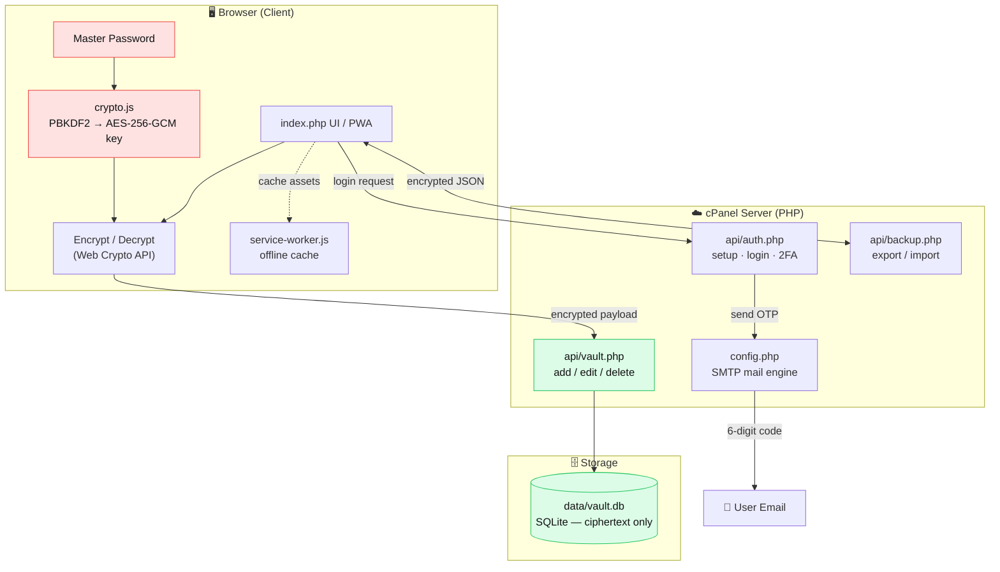
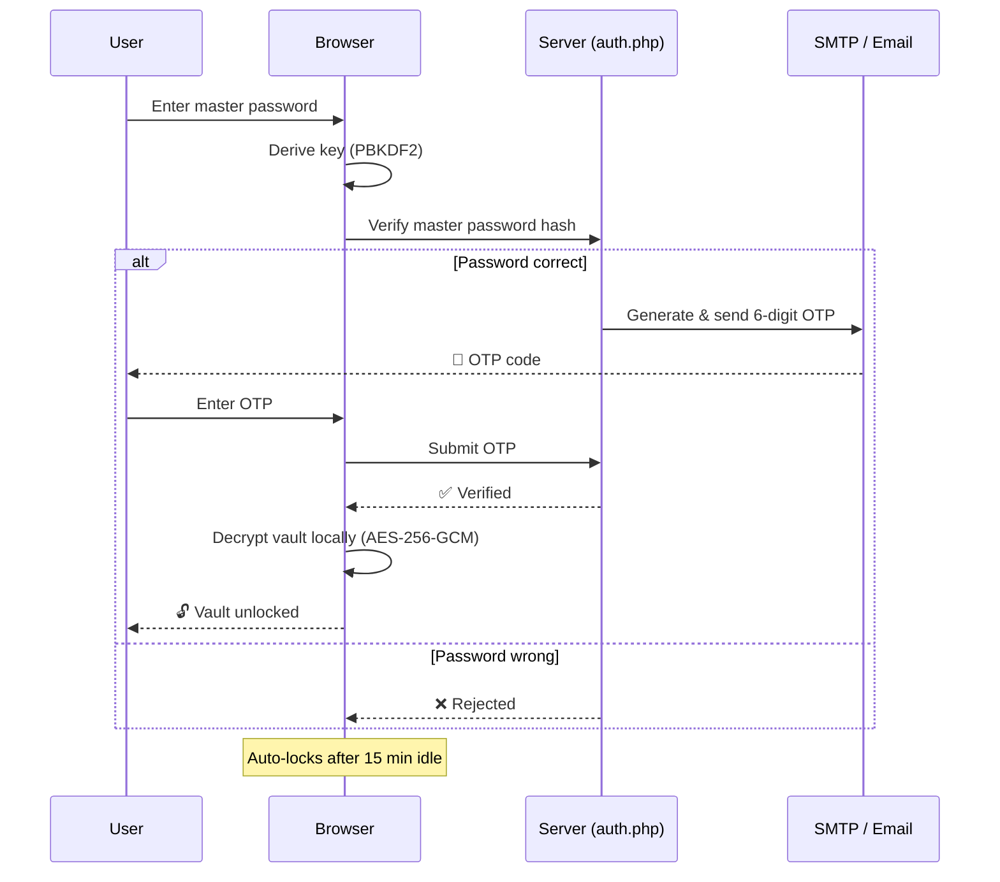

# 🦡 SafeBadger — Personal Password Manager (cPanel & iOS PWA)

> **A self-hosted, zero-knowledge, end-to-end encrypted personal password vault.**

SafeBadger is a personal password manager that runs on any cPanel hosting environment with **zero configuration**. It uses **zero-knowledge**, end-to-end **AES-256-GCM** encryption and behaves like a full native mobile app when added to the home screen from iOS Safari.

## 📖 About The Project

SafeBadger is built for users who don't want to hand their passwords to a third-party cloud and prefer to keep full control of their own data. Written in pure **PHP + SQLite**, it needs neither an external database server nor a complex setup — just drop the files onto your cPanel host and set a master password.

The core philosophy is **"the server can never see your data"**: all encryption and decryption happen inside the browser using the **Web Crypto API**. Only meaningless ciphertext ever reaches the server. On top of that, **email-based 2FA (OTP)**, auto-lock, encrypted backups and full **PWA** support make it both secure and pleasant to use every day.

**Tech Stack:** PHP 7.4+ · SQLite (optional MySQL) · Vanilla JavaScript · Web Crypto API (PBKDF2 + AES-256-GCM) · PWA (Service Worker + Manifest) · Apple Glassmorphism CSS

---

## 🌟 Key Features

- **🔒 Zero-Knowledge Client-Side Encryption**
  - Passwords and account details are encrypted in your browser (PBKDF2 + AES-256-GCM) **before** they ever leave the device.
  - The server and database never see plaintext — even the host owner opening the database finds only meaningless ciphertext.
- **📧 Two-Factor Email Verification (2FA OTP)**
  - After your master password is verified, a 6-digit one-time code is emailed to your configured address.
  - The vault stays locked until the correct code is entered.
- **📱 iOS PWA (Native App Feel)**
  - "Share ➔ Add to Home Screen" in iOS Safari for full-screen, chrome-free, native-like usage.
  - Apple glassmorphism design, smooth animations, iOS safe-area support.
- **🌗 Dark & Light Mode** — one-tap theme switching from the top bar or settings.
- **👤 Personal Avatar** — upload, change or remove your profile photo anytime.
- **⚡ Fast Copy & Security** — one-tap copy for username/password, a strong password generator (length, letters, digits, symbols, strength meter), and auto-lock after 15 minutes of inactivity.
- **💾 Encrypted Backup & Restore** — export/import all records as an encrypted JSON file.

---

## 🧭 How It Works (Architecture)



> 🔑 **The key insight:** the encryption key never leaves the browser. The server only ever stores and moves encrypted blobs (green), while the plaintext and master key (red) exist only on the client.

---

## 🔐 Login & Unlock Flow



---

## 🚀 cPanel Setup (3 Easy Steps)

Because the project uses SQLite, **you don't need to create a database or grant user privileges** in cPanel.

1. **Upload the files**
   - Zip all files in this project folder.
   - Log into cPanel and open the **File Manager**.
   - Go to `public_html` (or a subdomain folder such as `passwords.yourdomain.com`), upload the zip and **Extract** it.
2. **Check permissions**
   - Make sure the `data/` folder is writable (`755` or `777`) — the SQLite database is created there automatically.
   - `data/.htaccess` automatically blocks the database from being downloaded from outside.
3. **Initialize the vault**
   - Visit your site (e.g. `https://passwords.yourdomain.com`).
   - On the first screen, set a strong **Master Password** and initialize your vault!

*(Optional: to use MySQL, set `DB_TYPE` to `'mysql'` in `config.php` and fill in your database credentials.)*

---

## 📲 Using It As A Mobile App On iOS

1. Open **Safari** on your iPhone or iPad and visit your site.
2. Tap the **Share** icon at the bottom (the square with an upward arrow).
3. Scroll down and choose **"Add to Home Screen"**.
4. Tap **"Add"** in the top right.
5. It now runs as a standalone mobile app with its own SafeBadger icon on your home screen!

---

## 🛠️ Project Structure

```
├── index.php                 # Main application & PWA interface
├── config.php                # Database & security configuration + mail engine
├── manifest.webmanifest      # PWA manifest (iOS / Android)
├── service-worker.js         # Offline cache & service worker
├── .htaccess                 # Apache / cPanel security & compression rules
├── api/
│   ├── auth.php              # Status, setup, authentication & 2FA API
│   ├── vault.php             # Encrypted add/edit/delete records API
│   └── backup.php            # Encrypted JSON export & import
├── data/
│   ├── .htaccess             # Database protection rule
│   └── vault.db              # SQLite database (auto-created, git-ignored)
└── assets/
    ├── css/style.css         # Apple glassmorphic dark & light CSS
    ├── js/
    │   ├── crypto.js         # PBKDF2 & AES-256-GCM client encryption engine
    │   ├── app.js            # Vault management, theme & avatar
    │   └── pwa.js            # iOS add-to-home-screen helper
    └── icons/                # iOS & PWA high-resolution icons
```

---

## ⚙️ Configuration & Security Notes

- **SMTP password:** In the repo, `SMTP_PASS` in `config.php` is intentionally left as the `YOUR_SMTP_PASSWORD` placeholder. Set your own cPanel email account password before going live.
- **Email address:** 2FA codes and password-reset links are sent to the `AUTH_EMAIL` address in `config.php` — replace it with your own.
- **Sensitive files are not committed:** `data/vault.db` (the vault database), one-time OTP and password-reset log files are excluded via `.gitignore`. The database is created automatically on first run.
- **Master Password:** It is the only key to your vault. By design, a **forgotten master password cannot be reset or recovered** — choose one that is both strong and memorable.

---

## 📄 License

Built for personal use. Feel free to use and customize it as you wish.
